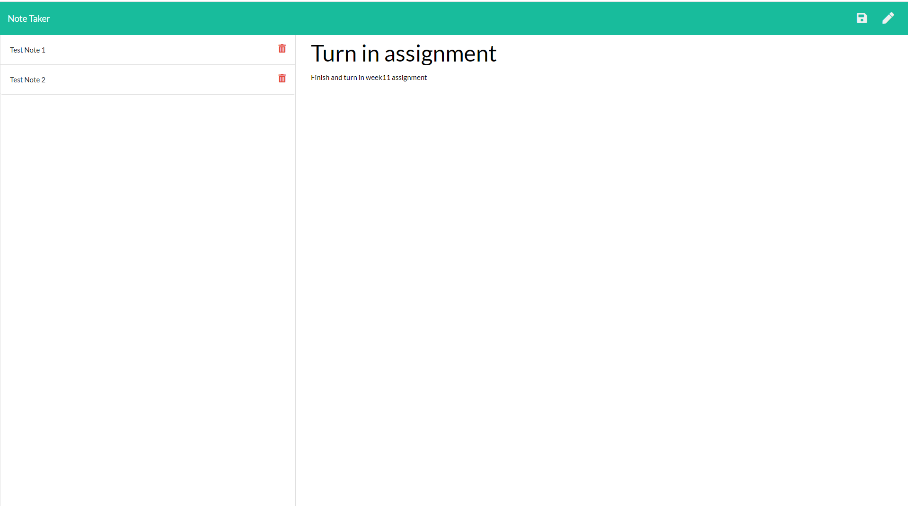

  # Note Taker
  
  
  ## Description
  This application is set up for the user to be able to create, delete, and view notes that are made.  The user can give the note a title and text of their desire and the api will provide an unique id and then the entire note is sent to a json file and stored with the rest of the notes that are created.  To view a note the user just needs to click the desired note title on the side and the note information will be brought up.  To delete a note the user just hits the trash icon on the desired note and the note is pulled and deleted from the json file and title list.  To view the web application just go to: (https://mysterious-cliffs-92619.herokuapp.com/).

  

  ## Table of Contents
  * [Installation](#installation)
  * [Usage](#usage)
  * [License](#license)
  * [Contributing](#contributing)
  * [Tests](#tests)
  * [Questions](#questions)
    
  ## Installation
  All that the user needs to do is go to the URL above at the end of description.

  ## Usage
  First thing is to click the Get Started button on the homepage and you will be taken to the notes page and you are set to take notes.  Use the pencil icon to start a new note and the trash icon to delete a certain note.  A save icon will come up when both title and text fields are filled in and you hit that icon to save the note to the json file.

  ## License
  [MIT](https://opensource.org/licenses/MIT)

  ## Contributing
  This application is not to be changed at this time.  If you would like to use the webpage itself be my guest.  Thank you and enjoy!

  ## Tests
  To test this app: First make sure the Get Started button works, then test to see if the create note functionality works, along with the view and delete note functionality, and finally go to (https://mysterious-cliffs-92619.herokuapp.com/api/notes) and make sure all notes are there with unique ids.

  ## Questions
  * Contact me on [Github](http://www.github.com/DuncanMarten)
  * Contact me by [email](mailto:duncanmarten@yahoo.com?subject=[Question]%20About%20Note Taker)
  